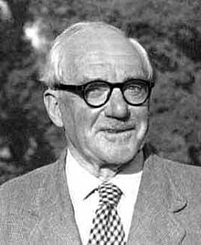

<table class="infobox biography vcard">
<tbody>
<tr>
<th colspan="2">

John E. Littlewood

 

<a title="Fellow of the Royal Society" href="https://en.wikipedia.org/wiki/Fellow_of_the_Royal_Society">FRS</a>

</th>
</tr>
<tr>
<td colspan="2"></td>
</tr>
<tr>
<th scope="row">Born</th>
<td>

John Edensor Littlewood

 9 June 1885 

<a title="Rochester, Kent" href="https://en.wikipedia.org/wiki/Rochester,_Kent">Rochester</a>,&nbsp;<a title="Kent" href="https://en.wikipedia.org/wiki/Kent">Kent</a>, England

</td>
</tr>
<tr>
<th scope="row">Died</th>
<td>6 September 1977&nbsp;(aged&nbsp;92) 

<a title="Cambridge" href="https://en.wikipedia.org/wiki/Cambridge">Cambridge</a>, England

</td>
</tr>
<tr>
<th scope="row">Alma&nbsp;mater</th>
<td><a title="Trinity College, Cambridge" href="https://en.wikipedia.org/wiki/Trinity_College,_Cambridge">Trinity College, Cambridge</a></td>
</tr>
<tr>
<th scope="row">Known&nbsp;for</th>
<td><a title="Mathematical analysis" href="https://en.wikipedia.org/wiki/Mathematical_analysis">Mathematical analysis</a></td>
</tr>
<tr>
<th scope="row">Awards</th>
<td>

<ul>
<li><a title="Smith's Prize" href="https://en.wikipedia.org/wiki/Smith%27s_Prize">Smith's Prize</a>&nbsp;(1908)</li>
<li><a title="Royal Medal" href="https://en.wikipedia.org/wiki/Royal_Medal">Royal Medal</a>&nbsp;(1929)</li>
<li><a title="De Morgan Medal" href="https://en.wikipedia.org/wiki/De_Morgan_Medal">De Morgan Medal</a>&nbsp;(1938)</li>
<li><a title="Sylvester Medal" href="https://en.wikipedia.org/wiki/Sylvester_Medal">Sylvester Medal</a>&nbsp;(1943)</li>
<li><a title="Copley Medal" href="https://en.wikipedia.org/wiki/Copley_Medal">Copley Medal</a>&nbsp;(1958)</li>
<li><a class="mw-redirect" title="Senior Berwick Prize" href="https://en.wikipedia.org/wiki/Senior_Berwick_Prize">Senior Berwick Prize</a>&nbsp;(1960)</li>
</ul>

</td>
</tr>
<tr>
<td colspan="2"><strong>Scientific career</strong></td>
</tr>
<tr>
<th scope="row">Fields</th>
<td class="category">Mathematician</td>
</tr>
<tr>
<th scope="row">Institutions</th>
<td><a title="Trinity College, Cambridge" href="https://en.wikipedia.org/wiki/Trinity_College,_Cambridge">Trinity College, Cambridge</a></td>
</tr>
<tr>
<th scope="row"><a title="Doctoral advisor" href="https://en.wikipedia.org/wiki/Doctoral_advisor">Doctoral advisor</a></th>
<td><a title="Ernest Barnes" href="https://en.wikipedia.org/wiki/Ernest_Barnes">Ernest Barnes</a></td>
</tr>
<tr>
<th scope="row">Doctoral students</th>
<td>

<ul>
<li><a title="A. O. L. Atkin" href="https://en.wikipedia.org/wiki/A._O._L._Atkin">A.&nbsp;O.&nbsp;L. Atkin</a></li>
<li><a title="Sarvadaman Chowla" href="https://en.wikipedia.org/wiki/Sarvadaman_Chowla">Sarvadaman Chowla</a></li>
<li><a title="Harold Davenport" href="https://en.wikipedia.org/wiki/Harold_Davenport">Harold Davenport</a></li>
<li><a title="Srinivasa Ramanujan" href="https://en.wikipedia.org/wiki/Srinivasa_Ramanujan">Srinivasa Ramanujan</a></li>
<li><a title="Stanley Skewes" href="https://en.wikipedia.org/wiki/Stanley_Skewes">Stanley Skewes</a></li>
<li><a title="Donald C. Spencer" href="https://en.wikipedia.org/wiki/Donald_C._Spencer">Donald C. Spencer</a></li>
<li><a title="Albert Ingham" href="https://en.wikipedia.org/wiki/Albert_Ingham">Albert Ingham</a></li>
</ul>

</td>
</tr>
</tbody>
</table>
 

 

<h2> Books </h2>

<ul>

                             

 <li><a target="_blank" href="https://github.com/manjunath5496/John-Edensor-Littlewood-Books/blob/master/hood(1).rar" style="text-decoration:none;">Inequalities</a></li>

 <li><a target="_blank" href="https://github.com/manjunath5496/John-Edensor-Littlewood-Books/blob/master/hood(2).pdf" style="text-decoration:none;">A Mathematician's Miscellany</a></li>

 </ul>
